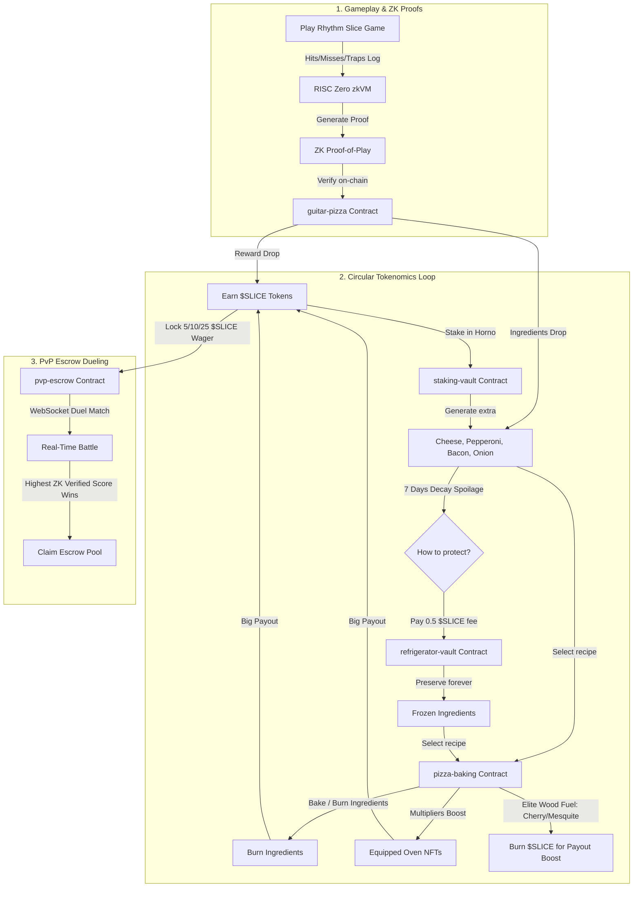
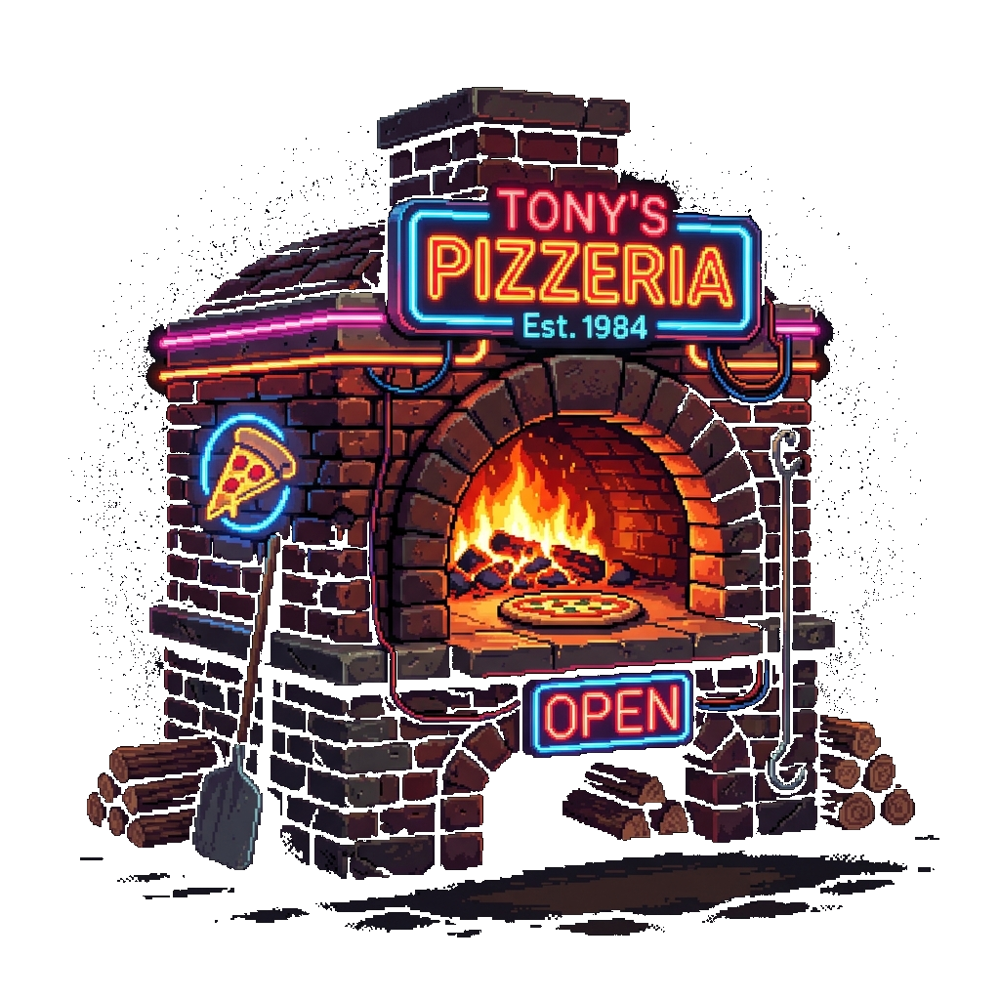
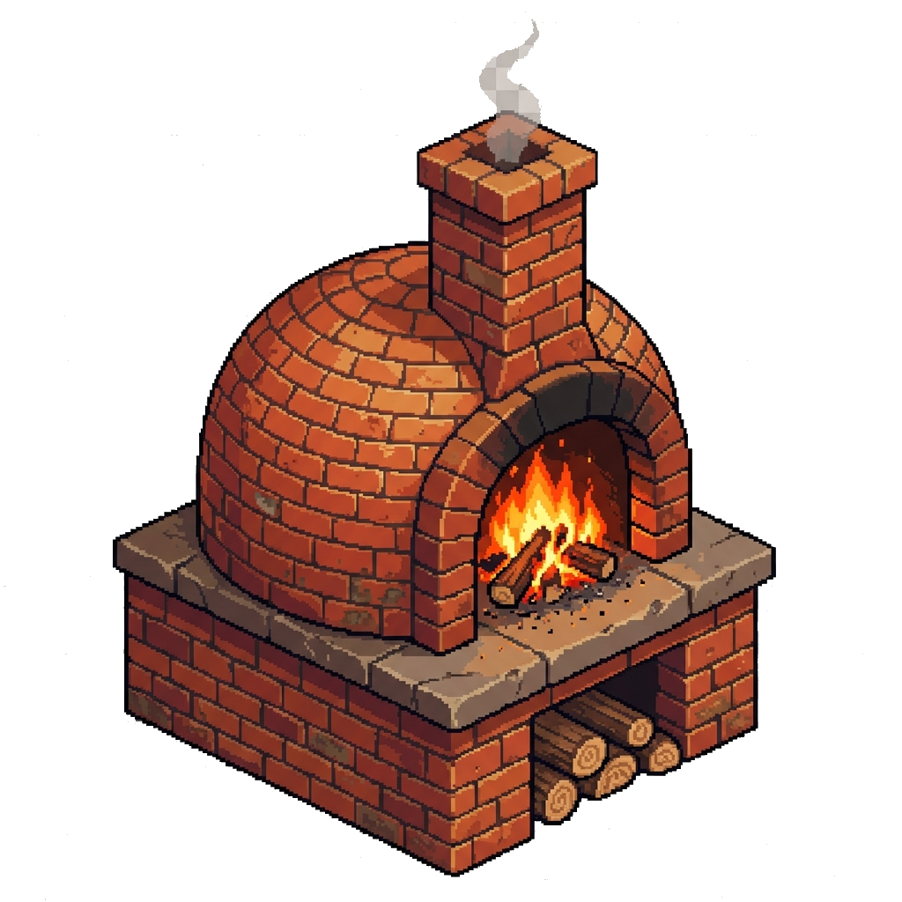
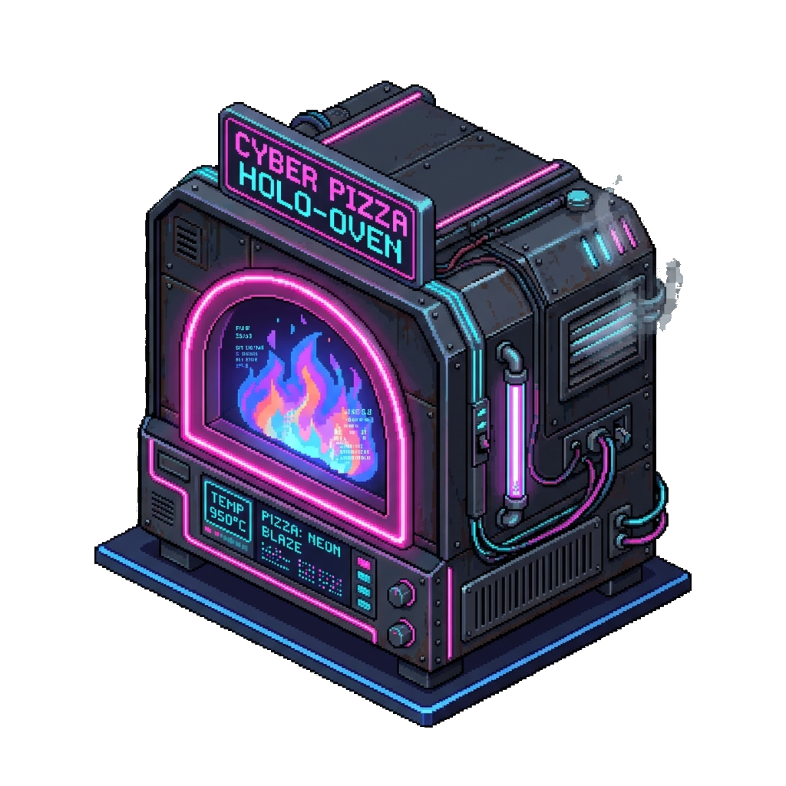
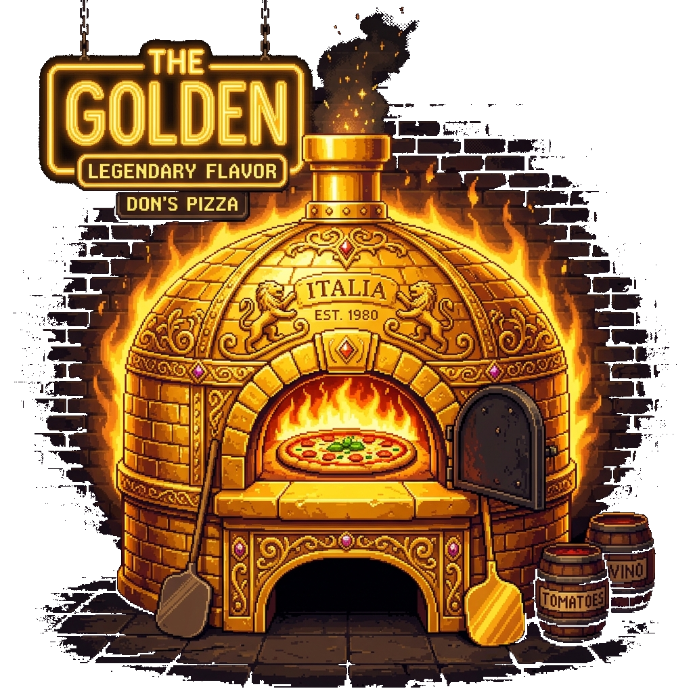

# 🍕 Rhythm Slice — ZK-Verified Mafia Pizzeria Rhythm Game on Stellar

> **Stellar Hacks: ZK Gaming Hackathon Submission**  
> A premium retro-arcade style rhythm game where every note hit and pizza baked is cryptographically proven off-chain and verified on-chain.

<div align="center">
  
  <br />
  <a href="https://rhythmslice.spicycrust.com"><strong>🎮 Play Live Demo: rhythmslice.spicycrust.com</strong></a>
</div>

---

## 🌟 The Concept: Welcome to La Cucina of the Pizza Mafia

In **Rhythm Slice**, you don't just click circles or press buttons — you are **Benny the Cook**, baking under the strict supervision of the Pizza Mafia. 

Every level is a song chart where you must hit key ingredients (Cheese, Pepperoni, Bacon, Onion) on the beat while avoiding toxic traps (spilled sauce, spoiled toppings). The better you play, the more ingredients you harvest. 

But there's a catch: **La Casa does not trust a cook's word.** To claim your rewards, you must submit a cryptographically verified **Zero-Knowledge Proof (ZK Proof)** of your gameplay session, generated in your browser using **RISC Zero zkVM**.

---

## 🔄 The $SLICE Circular Economy

Rhythm Slice features a fully closed, multi-contract economic loop designed to encourage constant play, strategic staking, and NFT utilization:



### 1. Timed-Baking (El Horno de la Famiglia)
Once you have harvested ingredients, enter the bakery. Choose from multiple recipes to bake:
*   **🍕 Margherita**: Basic recipe (10 seconds, pays out 15 $SLICE).
*   **🍖 Pepperoni**: Medium recipe (30 seconds, pays out 40 $SLICE).
*   **⭐ Speciale**: Advanced recipe (60 seconds, pays out 100 $SLICE).
*   **🍄 Tartufo Prestigio, Dolce Vita & della Mafia**: Premium prestige recipes requiring rare ingredients (earned from daily quests) paying up to **250 $SLICE**.
*   **🔥 Wood Fuel Selection**: Boost your ovens by selecting premium wood! Standard wood is free, while **Cherry Wood (0.5 $SLICE)** and **Mesquite Wood (1.2 $SLICE)** speed up baking times and boost yield.

### 2. Ingredient Spoilage & Cold Storage
Raw ingredients expire and rot after **7 days**. To protect your culinary capital, deposit your ingredients into the `refrigerator-vault` contract by paying a flat **0.5 $SLICE fee**. Frozen ingredients are preserved indefinitely.

### 3. $SLICE LP Staking (Defindex Integration)
Deposit your `$SLICE` and `XLM` 50/50 into the official **Defindex Vault** directly from the dashboard. Earn Defindex LP tokens on-chain and compound your mafia tokens passively.

---

## 🖼️ Equipped Oven NFTs Collection
Baking is amplified by equipping **Oven NFTs**. Higher rarity ovens reduce bake times and multiply payouts. 

| Oven NFT | Style / Rarity | Benefit |
|----------|----------------|---------|
|  | **The OG Oven** (Common) | Baseline baking speed |
|  | **Brick Oven** (Uncommon) | -10% Bake Time |
|  | **Neon Oven** (Rare) | -25% Bake Time, +10% Payout |
|  | **Golden Capo** (Legendary) | -50% Bake Time, +30% Payout |

---

## 🔑 Key Web3 Features & Upgrades

### 1. Biometric Onboarding (Passkeys)
*   **Keyless Non-Custodial Wallets**: Using the WebAuthn standard, players can sign up and sign Stellar transactions using their device's PIN or biometrics (TouchID/FaceID).
*   **Sponsored Transactions**: PizzaDAO sponsors the gas fee of Passkey players on the testnet using transaction wrapping (**Fee-Bump** envelopes), allowing a 100% gasless user experience.

### 2. Real-Time PVP Multiplayer
*   **WebSocket Matchmaking**: Enter the queue to get paired up with another cook instantly.
*   **RTT Latency Sync**: Interactive RTT checks sync the note charts so both players start at the exact same millisecond.
*   **Tug-of-War PvP Escrow**: Both players lock $SLICE in `pvp-escrow` before playing. The contract evaluates both ZK Proofs and automatically releases the pool to the cook with the highest score.

### 3. Daily Quests (Contratos del Día)
*   Complete dynamic daily objectives (e.g., Bake 2 pizzas, play 1 song, use premium fuel) to earn **Prestige Ingredients** (Truffle, Fig, Caviar, Gold Flakes) and bake luxury recipes!

### 4. La Famiglia (Friends List)
*   **Zero-Gas Local Storage**: Keep your mafia crew cataloged using zero-gas localStorage via Zustand Persist. No Stellar fees or network latency to look up your rivals.
*   **Direct Dueling Challenge**: Challenge contacts from your friend list instantly via a one-click challenge button which automatically configures a PvP duel order in the lobby.

---

## 📚 Documentación Adicional (Spanish & English)

Para más detalles técnicos, arquitectónicos y de juego, explora las guías dedicadas en la carpeta [docs/](file:///d:/00%20PROGRAMANDO/guitarPizza--AntiGravity/stellar-game-studio/docs/):

*   **[Guía del Desarrollador (Developer Guide)](file:///d:/00%20PROGRAMANDO/guitarPizza--AntiGravity/stellar-game-studio/docs/developer_guide.md)**: Comandos del SDK, compilación de Soroban, scaffolding de nuevos juegos y testing.
*   **[Arquitectura ZK (ZK Architecture)](file:///d:/00%20PROGRAMANDO/guitarPizza--AntiGravity/stellar-game-studio/docs/zk_architecture.md)**: Explicación de los circuitos Noir, la generación del journal de RISC Zero y la verificación on-chain.
*   **[Guía de Tokenomics Circular (Tokenomics)](file:///d:/00%20PROGRAMANDO/guitarPizza--AntiGravity/stellar-game-studio/docs/tokenomics_guide.md)**: Funcionamiento técnico de El Horno, congelamiento clásica, pools de Defindex, Neveras y decay de ingredientes.
*   **[Manual del Jugador (Player Manual)](file:///d:/00%20PROGRAMANDO/guitarPizza--AntiGravity/stellar-game-studio/docs/player_manual_es.md)**: Manual inmersivo en español para aprender a jugar, conseguir ingredientes y progresar en el imperio de la pizza de la mafia.

---

## 🛠️ Tech Stack & Architecture

| Layer | Technology |
|-------|-----------|
| **Blockchain** | Stellar Soroban (Rust SDK 25.0.2) |
| **Zero-Knowledge** | RISC Zero zkVM |
| **Frontend** | React 19 + TypeScript + HTML5 Canvas |
| **Real-Time Layer** | WebSockets Signaling (Go-ready API) |
| **Styling** | Vanilla CSS + HSL Dark Pizzeria aesthetics |

---

## 📦 Smart Contract addresses (Stellar Testnet)

All smart contracts are written in Rust for Soroban (SDK v25.0.2). Below are the current active addresses deployed on Stellar Testnet:

| Contract | Address | Purpose / Description |
| :--- | :--- | :--- |
| **`guitar-pizza`** | `CCBDKEBNL3KH4FSRH6UCS72COWIP4Z7DRU74NSZMKJO2TXTKXACSZVVJ` | Core rhythm game session validation, rewards mint gating. |
| **`slice-token`** | `CACFX6EO72DX2HC5JC7M66TDESTEQ6VOYZXKVKB6NOH52LIL4GQDRDIL` | Main utility and governance token ($SLICE) of the pizzeria economy. |
| **`refrigerator-vault`** | `CA4HNGFAIFGLHJ4ZBEK4FWIV33FOQEEXMO4EQQOAPPOK4J6NWFP7XSB4` | Ingredient preservation vault (neveras) with flat fee burning. |
| **`pizza-baking`** | `CAIQHGCF2374CULXFW3D3XC3GYIEMLZC4QLLKV76SM5VC33MDMGXH25B` | Timed-Baking Oven system (El Horno de la Famiglia). |
| **`staking-vault`** | `CBX3ABOYGTTSLFXQ7FWGL2Q3QN7DZMTXWBFSU2JWC2KZEQQLUIVI7MRW` | Classic Staking system with progression tiers (Piccolino to Don). |
| **`defindex-lp-token`** | `CDJUV7O3RKHN2SEZXHEOSJPS3OJUHD4IGMQQGIP26AJPV5XZYES5YHZC` | Defindex single-asset/LP Yield Farming integration token. |
| **`pvp-escrow`** | `CBGL7NQJBHXKJJPYWQF3UGAGEHWH72LHBOHDGOTU242XAEH5PXOTCALD` | Real-time matchmaking duel wagers and score validation escrow. |
| **`nft-collectibles`** | `CBC3AGOZTWKEII45VBRWLOGMBNGBJ6ABPP6MOFAZM2HFHP2NKPXXEWXB` | Oven NFTs Collection contract (Common to Legendary). |
| **`zk-leaderboard`** | `CCGP2I2A5E7OKNHPWJVHDGQCTUIF2GLJEBOZO72LDDZ7ILY65ECEEV3S` | On-chain top-10 high score list gated by ZK receipt verification. |
| **`mock-game-hub`** | `CC52YOVJEFKQT7GIIJ3HVRWZGEOGJZLQXR3AL6HAK6J5NWQMFS7RFMSM` | Game Studio Session Lifecycle Hub (standardized start/end triggers). |
| **`risc0-verifier`** | `CDSM3KQPI2M7X6CWMMKVNKZKYY73JZ2YBMW5U3V4EEELH2BRYSE6KJKC` | RISC Zero zkVM receipt and proof verification contract. |
| **`tournaments`** | `CADTV5WUWYWTBUEURYJ2MIE5UZ4HKVDNVST4KNJ34JPBBTKEWQ4QVGNM` | Bracket tournaments and multiplayer events contract. |

---

## 🚀 Quick Start for Developers

To run and test the ecosystem locally:

```bash
# Clone the repository
git clone https://github.com/CaBsCrypto/guitarPizza--AntiGravity.git
cd guitarPizza--AntiGravity/stellar-game-studio

# Install dependencies
pnpm install

# Compile contracts and generate Soroban JS bindings
pnpm run setup

# Run the frontend dev server
pnpm run dev
```

Built with ❤️ for **Stellar Hacks: ZK Gaming**.
