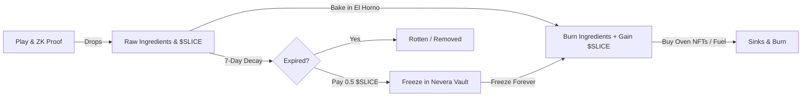

# Rhythm Slice — $SLICE Economy & Tokenomics

Rhythm Slice utilizes a closed loop utility token model powered by `$SLICE` to drive economic activity, incentivize staking, penalize inactivity through ingredient spoilage, and reward elite gameplay.

---

## 🔄 The Economic Loop

---

## 🥖 El Horno de la Famiglia (Staking Vault)

Staking `$SLICE` locks utility tokens to unlock passive multipliers. Staking tiers determine the yield boost on ingredient drops and score calculations:

| Tier | Required $SLICE | Score Multiplier | Ingredient Drop Multiplier |
| :--- | :--- | :--- | :--- |
| **Piccolino** | 100+ $SLICE | $+5\%$ | $1.0\times$ |
| **Soldato** | 500+ $SLICE | $+15\%$ | $1.5\times$ |
| **Caporegime** | 2,000+ $SLICE | $+35\%$ | $2.5\times$ |
| **Don de la Masa** | 5,000+ $SLICE | $+60\%$ | $4.0\times$ |

---

## ❄️ Nevera Vault & Spoilage Decay

To keep the game economy active and prevent hyperinflation of ingredient assets, raw ingredients expire and rot after **7 days** if left unused.

*   **Pantry (Raw Ingredients)**: Cheese (CHE), Pepperoni (PEP), Bacon (BAC), and Onion (ONI) are subject to a 7-day linear decay countdown.
*   **Nevera Vault (Cold Storage)**: Players can deposit ingredients into the `refrigerator-vault` contract.
*   **Tariff**: Freezing raw ingredients costs a flat fee of **0.5 $SLICE** per batch.
*   **Result**: Once frozen, the decay countdown halts forever. Frozen ingredients are safe to use for recipes at any time.

---

## 🍕 Timed-Baking Recipes & Wood Fuel

Harvested ingredients are baked into pizzas to earn larger payouts of `$SLICE` tokens. 

### 1. Recipes Table

| Recipe | Difficulty | Ingredients Required | Bake Time | Payout |
| :--- | :--- | :--- | :--- | :--- |
| **Margherita** | Basic | 1x CHE | 10s | 15 $SLICE |
| **Pepperoni** | Medium | 1x CHE + 1x PEP | 30s | 40 $SLICE |
| **Speciale** | Advanced | 1x CHE + 1x PEP + 1x BAC | 60s | 100 $SLICE |
| **Tartufo Prestigio** | Premium | 1x CHE + 1x ONI + 1x TRU (Truffle) | 120s | 180 $SLICE |
| **Dolce Vita** | Luxury | 1x CHE + 1x FIG (Fig) + 1x CAV (Caviar) | 180s | 250 $SLICE |

*Note: Rare/Prestige ingredients (Truffle, Fig, Caviar, Gold Flakes) are awarded through Daily Quests.*

### 2. Premium Wood Fuel
Speed up cooking times and increase ingredient payouts by burning $SLICE for fuel selection:
*   **Standard Wood**: Free (1.0x speed, 1.0x payout).
*   **Cherry Wood**: Costs **0.5 $SLICE** (reduces bake time by 20%, yields +10% $SLICE).
*   **Mesquite Wood**: Costs **1.2 $SLICE** (reduces bake time by 45%, yields +25% $SLICE).

---

## 📊 LP Staking (Defindex Integration)

For high-yield farming, players can integrate with Defindex pools directly from the dashboard:
*   **Single-Sided $SLICE Vault**: Earns a **2.0x** multiplier on ingredient drops. Zero risk of Impermanent Loss.
*   **Super-Horno LP Pool (50/50 SLICE-XLM)**: Earns a massive **4.0x** multiplier on ingredient drops. Subject to market volatility and Impermanent Loss (IL) risks.
