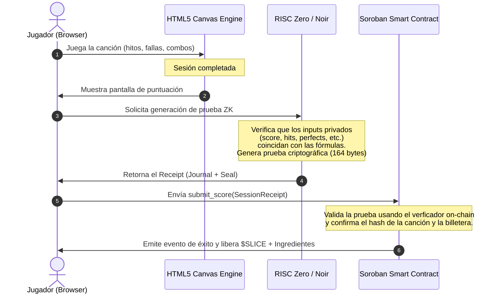

# Rhythm Slice — ZK Architecture & Verification

Rhythm Slice prevents gameplay cheating (like score modification or false transaction claims) by requiring a **Zero-Knowledge Proof (ZK Proof)** of successful gameplay before claiming on-chain rewards or submitting scores to the global leaderboard.

---

## 🔄 ZK Proof Generation & Submission Flow



---

## 🔍 Noir ZK Circuit Details

The Noir circuit enforces mathematical constraints on game statistics. It is located at `circuits/guitar_pizza_proof/src/main.nr`.

### 1. Private Inputs
These stats are kept hidden from the public blockchain to keep transaction payloads light and preserve game-state secrecy:
*   `score`: The calculated score of the session.
*   `perfect_hits`: Number of perfectly timed notes.
*   `total_hits`: Total notes hit.
*   `total_notes`: Total number of notes defined in the chart.
*   `traps_avoided`: Spilled sauce/toxic traps successfully avoided.
*   `total_traps`: Total traps spawned in the level.
*   `fever_seconds`: Total seconds spent in Fever multiplier state.
*   `pizzas_completed`: Total completed pizza orders.

### 2. Public Inputs
These inputs are submitted to the smart contract and exposed publicly to tie the proof to the active blockchain transaction:
*   `level_id`: The ID of the song level played.
*   `session_id`: Unique session identifier generated by the Game Hub.
*   `score_goal`: The target score required to win.

### 3. Circuit Constraints & Rules
The circuit enforces the following rules to guarantee score integrity:
1.  **Logical Consistency**:
    *   `total_hits <= total_notes`
    *   `perfect_hits <= total_hits`
    *   `traps_avoided <= total_traps`
2.  **Safety Boundaries**:
    *   `fever_seconds <= 300` (caps fever duration to a maximum of 5 minutes).
    *   `pizzas_completed <= 20` (prevents overflow exploit).
3.  **Score Equation Verification**:
    *   `score == (total_hits * 100) + (perfect_hits * 50) + (fever_seconds * 200) + (pizzas_completed * 500)`
4.  **Victory Condition**:
    *   `score >= score_goal`

---

## 🛠️ Compiling & Proving Locally

If you modify the ZK circuits, compile them using Noir's CLI:

```bash
cd circuits/guitar_pizza_proof
# Compile circuit
nargo compile

# Generate the Verification Key (VK)
bb write_vk_ultra_honk -b target/guitar_pizza_proof.json -o target/vk
```
